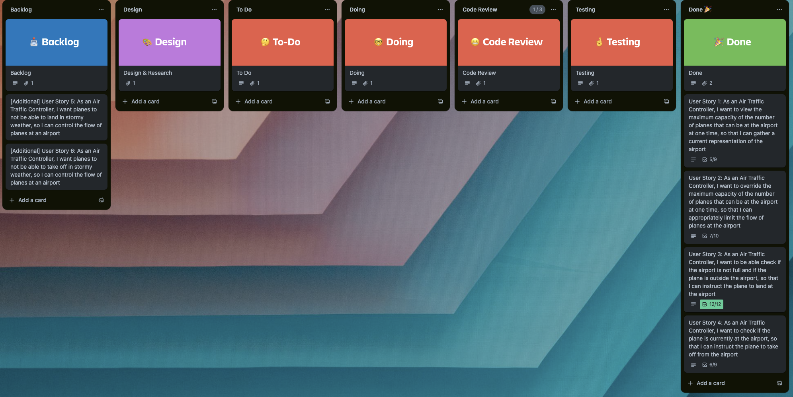

# Business Awareness

### The Trello screenshot demonstrates my understanding of prioritisation techniques with project timescales:

#### Link to Trello Kanban Board:
https://trello.com/invite/b/n4P8Fxo1/ATTI7efa9fcfdf32a9d341d07f96e8464464C78333FB/challenge-1-airport-challenge

## Project Objectives:
- WHAT - The client wishes to have help with new software.
- WHY - The client is doing this project in order to improve the flow of planes at the airport.
- WHEN - The client has specified it wants the software ready for review by Monday 22 January 2024.

## Project Approach:
- The project will adopt an Agile approach to get continuous feedback
- It will use Trello to present a Kanban board for workflow processes such as backlog, design, code review or testing.
- The project will use individual branches on Git to separate out each User Story and the tests.

## Project Results:
- A developed software application meeting all requirements will be deliverable by the timescale listed in the Objectives.
- Completed comprehensive documentation in docs folder.
- Jamie A., Software Engineer, will be trained further through doing the Challenge.